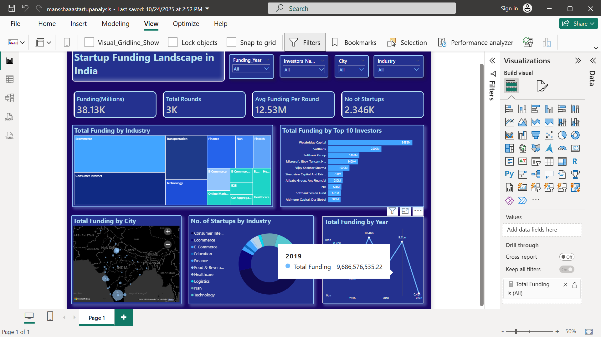

# 🚀 Startup Funding Analysis — India (2015–2020)


An end-to-end data analysis project exploring **3,044 startup funding rounds** in India. The project covers data cleaning, exploratory analysis, SQL-based querying, and interactive Power BI dashboarding.

---

## 📊 Power BI Dashboard

<p align="center">
  
</p>

---

## 📌 Key Insights

| Metric | Value |
|--------|-------|
| 📈 **Peak Funding Year** | 2017 (~$10.4 Billion) |
| 🏢 **Top Funded Startup** | Paytm (~$3.15B total) |
| 💰 **Top Investor** | Westbridge Capital (~$3.95B) |
| 🏙️ **Top City** | Bengaluru |
| 🏭 **Top Industry** | E-commerce / Consumer Internet |
| 📊 **Avg Deal Size Growth** | $9.3M (2015) → $87M (2019) |

---

## ⚙️ Tech Stack

- **Python** — Pandas, NumPy, Matplotlib, Seaborn
- **SQL** — SQLite with SQLAlchemy for analytical queries
- **Jupyter Notebook** — Interactive analysis & visualization
- **Power BI** — Interactive dashboard for stakeholders

---

## 📁 Project Structure

```
Startup-Funding-Analysis/
├── data/
│   └── startup_funding.csv          # Raw dataset (3,044 records)
├── assets/
│   └── powerbi_dashboard.png        # Power BI dashboard screenshot
├── startup_funding_analysis.ipynb   # Main analysis notebook
├── requirements.txt                 # Python dependencies
├── .gitignore
└── README.md
```

---

## 🔧 Setup & Usage

```bash
# 1. Clone the repository
git clone https://github.com/Mansha0805/Startup-Funding-Analysis.git
cd Startup-Funding-Analysis

# 2. Create a virtual environment (optional but recommended)
python -m venv venv
source venv/bin/activate  # On Windows: venv\Scripts\activate

# 3. Install dependencies
pip install -r requirements.txt

# 4. Launch Jupyter Notebook
jupyter notebook startup_funding_analysis.ipynb
```

---

## 🔍 Analysis Pipeline

1. **Data Loading** — Read raw CSV with 3,044 records × 10 columns
2. **Data Cleaning** — Fix malformed dates, normalize city names, remove Unicode artifacts, convert funding amounts to numeric
3. **Exploratory Analysis** — Visualize funding trends by year, top startups, top cities, and investment types
4. **SQL Analysis** — Load cleaned data into SQLite for complex queries (top investors, city-industry combos, multi-investor startups)
5. **Power BI Export** — Export cleaned CSV for interactive dashboard creation

---

## 📝 Data Source

The dataset contains Indian startup funding records from **January 2015 to January 2020**, sourced from public startup funding trackers.

**Columns:** Serial No, Date, Startup Name, Industry, SubVertical, City, Investors, Investment Type, Amount (USD), Remarks.

---

## 🤝 Contributing

Contributions, issues, and feature requests are welcome! Feel free to open an issue or submit a pull request.

---

## 📄 License

This project is open source and available under the [MIT License](LICENSE).
